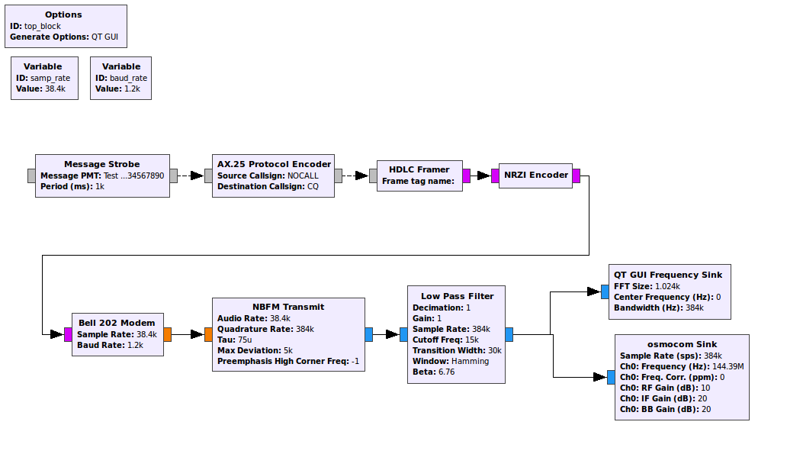

# gr-packetradio #

This is an out-of-tree module for GNURadio to work with modern packet radio.

## Modules ##
* AX.25 Protocol Encoder
* NRZI Encoder
* Bell 202 Modem for AFSK1200

## Install ##
1. Clone the git repo
`git clone https://github.com/sx3wiz/gr-packetradio.git`
2. `cd gr-packetradio`
3. `mkdir build`
4. `cd build/`
5. `cmake ../`
6. `make`
7. `sudo make install`
8. `sudo ldconfig`
9. Relaunch GRC if it was open

## Examples ##
* AX.25 AFSK1200 Examples
  
